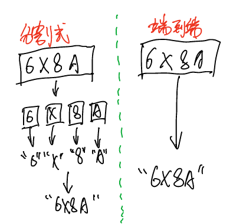
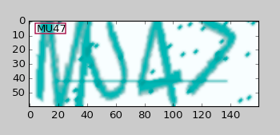
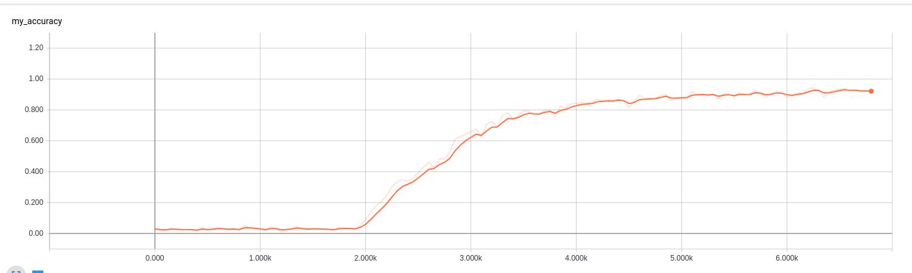
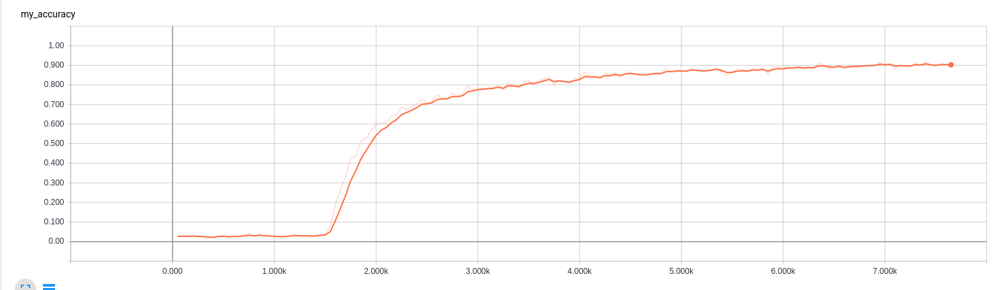
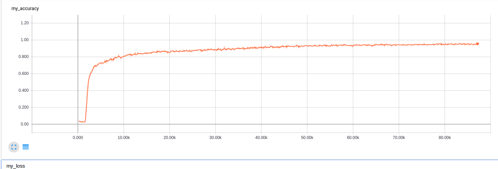

=====================================================
基于tensorflow的‘端到端’的字符型验证码识别
=====================================================

.. contents:: 目录
.. sectnum::

Abstract
================

验证码（CAPTCHA）的诞生本身是为了自动区分 **自然人** 和 **机器人** 的一套公开方法，
但是近几年的人工智能技术的发展，传统的字符验证已经形同虚设。
所以，大家一方面研究和学习此代码时，另外一方面也要警惕自己的互联网系统的web安全问题。

Keywords: 人工智能,Python,字符验证码,CAPTCHA,识别,tensorflow,CNN,深度学习

Introduction
=========================

全自动区分计算机和人类的公开图灵测试（英语：Completely Automated Public Turing test to tell Computers and Humans Apart，簡稱CAPTCHA），俗称验证码，是一种区分用户是计算机或人的公共全自动程序 [#captcha-wiki]_。

得益于基于卷积神经网络CNN的人工智能技术的发展，目前基于主流的深度学习框架的直接开发出 **端到端不分割** 的识别方式，而且在没有经过太多trick的情况下，已经可以达到95%以上的识别率。

传统的机器学习方法，对于多位字符验证码都是采用的 **化整为零** 的方法：先分割成最小单位，再分别识别，然后再统一。
卷积神经网络方法，直接采用 **端到端不分割** 的方法：输入整张图片，输出整个图片的标记结果，具有更强的通用性。

具体的区别如下图：

**端到端** 的识别方法显然更具备优势，因为目前的字符型验证码为了防止被识别，多位字符已经完全融合粘贴在一起了，利用传统的技术基本很难实现分割了。本文重点推荐的就是 **端到端** 的方法。

引用声明
=========================

本文的绝大部分思路和代码都参考自此文：

.. code::

    http://blog.topspeedsnail.com/archives/10858

感谢：斗大的熊猫--《WTF Daily Blog》

本项目主要解决的问题是对某一模式的字符型验证进行端到端的识别。

输入内容：

模型预测结果：

.. image:: ./images/tf-captcha-python-result.png

本文工作
========================

- 解释了原作者代码注释中提到的关于sigmoid选型的困惑问题并应用到代码中
- 将原作者的代码进行模块工程化，成为整体项目，方便研究的同学直接进行模式套用

原作者代码中：

.. code::

    def train_crack_captcha_cnn():
    	output = crack_captcha_cnn()
    	# loss
    	#loss = tf.reduce_mean(tf.nn.softmax_cross_entropy_with_logits(output, Y))
    	loss = tf.reduce_mean(tf.nn.sigmoid_cross_entropy_with_logits(logits=output, labels=Y))
            # 最后一层用来分类的softmax和sigmoid有什么不同？
    	# optimizer 为了加快训练 learning_rate应该开始大，然后慢慢衰
    	optimizer = tf.train.AdamOptimizer(learning_rate=0.001).minimize(loss)
    	……

作者在代码的注释中出提出了这样的疑问:

对 **softmax** 和 **sigmoid** 的使用方式有疑问。

然后在文章下面读者评论区也都提到了此问题，在此进行整体解释一下。

原文中CNN的输出的维度是 **MAX_CAPTCHA*CHAR_SET_LEN** ，其实这些维度并不都是完全独立分布的，
但是使用sigmoid loss也是仍然可以的，相当于先用sigmoid进行了一次归一化，然后再将各个维度的值向目标值进行 **回归** ，
最后loss越小，两个向量的对应的值也越接近。 **其实sigmoid是可以看成是一个多分类的问题，在这个例子上也能起到比较好的收敛效果**。

当然，关于分类的问题，看所有的机器学习框架里面，都是建议使用softmax进行最后的归一化操作，这其实相当于是一种 **马太效应** :
让可能性大的分类的值变得更大，让可能性小的分量值变得更小。但是这有个前提，就是参与到softmax运算的一组数据，必须是 **相关联** 的，
所以如果要使用 **softmax_cross_entropy_with_logits** ，只需要将网络进行简单修改即可。把输出的维度做成二维[MAX_CAPTCHA, CHAR_SET_LEN],
然后使用softmax loss。

.. code::

    output = crack_captcha_cnn()#36×4
    predict = tf.reshape(output, [-1, MAX_CAPTCHA, CHAR_SET_LEN])  # 36行，4列
    label = tf.reshape(Y, [-1, MAX_CAPTCHA, CHAR_SET_LEN])

最后使用GPU训练的实验结果对比：

- sigmoid方式。训练6000个step就能达到95%的准确率。
- softmax方式。训练8千个step，达到90%的准确率;训练8万个step，达到94.7%（跑了大半天）

使用tensorboard对accuracy进行监控：

sigmoid-6千个step:

softmax-8千个step:

softmax-8万个step:

整体来说，在这个例子里面，好像 sigmoid的收敛速度快些，当然这个可能是本项目里面的外界因素有利于sigmoid吧，至于具体原因，等后续再进行研究和解释吧，当然有可能根本解释不了，因为对于CNN，目前主流的意见都是：，反正效果就是好，但是不知道为啥， **科幻得近于玄幻** 的一种技术。

项目文件介绍：

- cfg.py 配置信息文件
- cnn_sys.py CNN网络结构
- data_iter.py 可迭代的数据集
- gen_captcha.py 验证码生成器，直接使用程序生成带标记的数据
- predict.py 加载训练好的模型，然后对输入的图片进行预测
- train.py 对模型进行训练
- utils.py 一些公共使用的方法

小结
==========

本文主要只写原作者没有提到的内容，想了解原文的，可以直接去原作者页面。

Reference
======================

.. [#captcha-wiki] wiki-CAPTCHA https://en.wikipedia.org/wiki/CAPTCHA

后续交流
====================

如果有对相关技术有持续关注的兴趣的同学，欢迎加入QQ群： 592109504

或者手机QQ扫码加入：

qq群：

